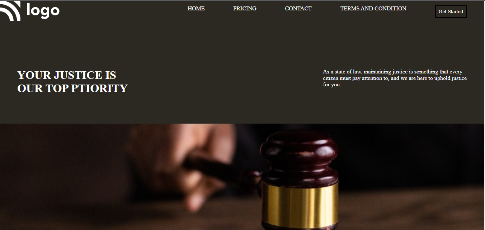

# Project-03 Html and Css

[Link of Deployed Live Project](https://courtjusticepage.netlify.app/)

# What I learned to make this project

- Confidence to make a front page by using html and css
- Css position , margin ,paddin 
- Background image control and color
- Managing of font-size and font-width

# Howmany time I spent to make it in proper view:-

- Almost I have spent my 3 hours to make this project